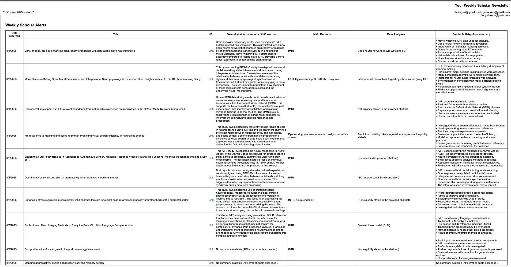

# Scholar Newsletter Apps Script

This project is a Google Apps Script that automatically collects your latest research alert emails from **Google Scholar Alerts**, extracts paper information and abstracts, summarizes them using Gemini AI, and sends you a weekly email digest—complete with concise bullet-point summaries for each paper. It is designed for researchers who want to efficiently stay up to date with new literature.

---

## Quick Start

**To get started right away, follow these steps:**

1. **Set up Google Scholar Alerts**  
   - Visit [Google Scholar Alerts](https://scholar.google.com/) and create alerts based on your research interests.  
   - Ensure you have at least one alert notification in your Gmail inbox.

2. **Organize your Gmail with Labels and Filters**  
   - In Gmail, create a new label (e.g., `PhD/research alerts`).  
   - Set up a filter:  
     - Criteria: `from:(scholaralerts-noreply@google.com)`  
     - Action: Apply the label you created.  
     - (Optional) Skip the Inbox (archive) and/or mark as read to keep your inbox tidy.

3. **Create a Google Sheet**  
   - This will serve as your database for storing alert information.

4. **Add the Apps Script**  
   - Open your Google Sheet and go to `Extensions → Apps Script`.
   - Delete any default code and **paste in the contents of `Code.gs` from this repository**.

5. **Update the Label Name**  
   - In the code, edit the label to match your Gmail label for Google Scholar alerts:  

     ```javascript
     var label = GmailApp.getUserLabelByName("PhD/research alerts");
     // Change "PhD/research alerts" to your actual label name
     ```

6. **Get a Gemini API Key**  
   - Visit [Google AI Studio](https://aistudio.google.com/app/apikey) to obtain your Gemini API key.
   - In the Apps Script editor, go to `Project Settings → Script Properties → Add Script Property`.
   - Set key as `GEMINI_API_KEY` and value as your API key.

7. **Set Up Triggers**  
   - In the Apps Script editor, click the clock icon (“Triggers”) and set up:
     - `checkScholarAlerts` (run daily or hourly)
     - `sendWeeklyNewsletter` (run weekly)

8. **Authorize the Script**  
   - Run each function once manually from the Apps Script editor to grant necessary permissions.

9. **You’re done!**  
   - The script will automatically create the required sheet and columns if they don’t exist.

> **Example files:**  



---

## Detailed Description

This script is designed specifically for Google Scholar alert emails. It streamlines the process of monitoring new research by:

- **Collecting Emails:**  
  It scans your Gmail for messages labeled as Google Scholar alerts.  
  > *Tip: Setting up a filter and label as described above ensures only relevant emails are processed.*

- **Extracting Paper Information:**  
  For each alert, it extracts the paper’s title, URL, and abstract.

- **Summarizing with Gemini AI:**  
  The script uses Gemini’s API to generate two types of summaries:  
  - A concise abstract summary (≤100 words)  
  - 5–8 concise bullet points, each limited to a single sentence or phrase (≤15 words).  
  > *Why use bullet points?* Bullet points make it easy to scan key findings and methods at a glance. If you want more or fewer points, or longer/shorter summaries, you can adjust the prompt in the code accordingly.

- **Sending Weekly Email Digest:**  
  Once a week, you’ll receive an HTML email summarizing all new papers from your alerts, complete with bullet-pointed key findings.

---

## Limitations & Notes

- **Gmail/Apps Script Quotas:**  
  Google Apps Script enforces daily quotas on email sending, API calls, and Gmail access. If you process a large number of alerts, you may hit these limits. See [Google Apps Script Quotas](https://developers.google.com/apps-script/guides/services/quotas) for details.

- **Gemini API Quotas:**  
  Gemini’s API has its own usage limits (requests per minute/day and monthly quotas). If you exceed these, summaries may be missing from your report.

- **Label Matching:**  
  The script only processes emails in the label you specify. Double-check your filter and label setup to ensure all Google Scholar alerts are included.

- **Manual API Key Setup:**  
  You must manually obtain and add your Gemini API key as described above.

- **No Audio Version (Yet):**  
  Currently, there is no automatic way to generate an audio version of your newsletter. Once Notebook LM releases an API, integrating audio summaries will be a fun next step!

- **Email Formatting:**  
  The weekly digest is sent as an HTML email. If you receive a very large number of alerts each week, you may hit Gmail’s email body size limit.  
  > *Tip: If this happens, consider running the script more frequently (e.g., twice a week) by adjusting the trigger schedule. To do this, edit the date range logic in the code (sendWeeklyNewsletter function) to match your desired reporting period.*

- **Error Handling:**  
  If the Gemini API fails or quota is exceeded, you’ll see a fallback message in your summary.

- **Only Validated for Google Scholar Alerts:**  
  This script is designed and tested specifically for Google Scholar alert emails. It will not work with other alert sources without modification.

---

## Personal Note

I hope you find this script helpful for keeping up with the latest research! My aim was to create a simple, minimal-code solution to help myself stay current with academic advances, so I hope others will find it useful as well.  
If you have trouble using it, have suggestions, want to share how you’re using it, or have ideas for improvement, please reach out: **yohayzvi@gmail.com**.

**P.S.**: Once Notebook LM offers an API, I look forward to integrating it for automatic audio versions of your weekly newsletter. Stay tuned!